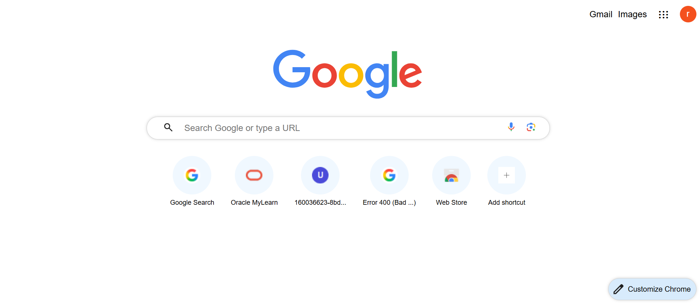

This project is a simple HTML & CSS recreation of the Google homepage. It demonstrates core web design skills such as layout structuring, alignment, spacing, and styling.

🔗 Live Demo: https://jahnavi-212.github.io/google-homepage-clone/ (jahnavi-212.github.io in Bing)

